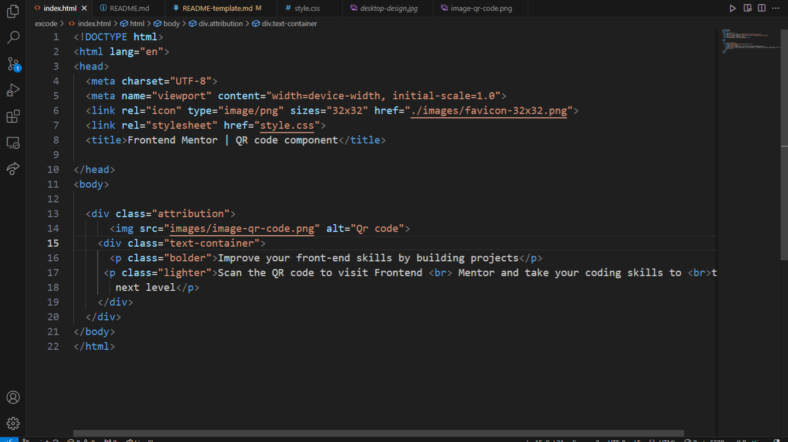
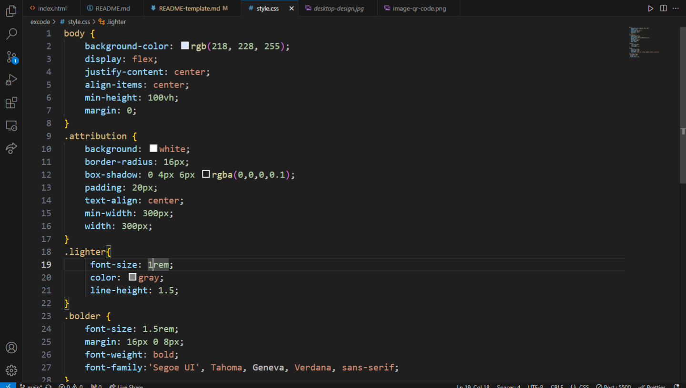
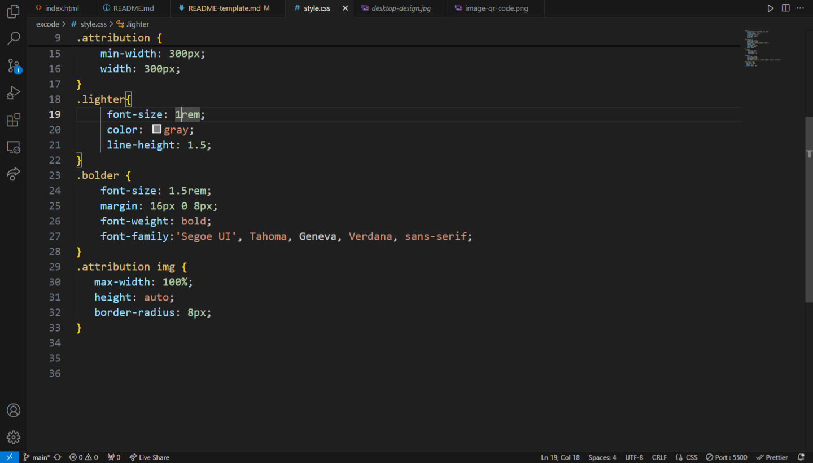

# Frontend Mentor - QR code component solution

This is a solution to the [QR code component challenge on Frontend Mentor](https://www.frontendmentor.io/challenges/qr-code-component-iux_sIO_H). Frontend Mentor challenges help you improve your coding skills by building realistic projects. 

## Table of contents
  - [Screenshot](#screenshot)
  - [Links](#links)
- [My process](#my-process)
  - [Built with](#built-with)
  - [What I learned](#what-i-learned)
  - [Continued development](#continued-development)
  - [Useful resources](#useful-resources)
- [Author](#author)
- [Acknowledgments](#acknowledgments)

### Screenshot

Add a screenshot of your solution. The easiest way to do this is to use Firefox to view your project, right-click the page and select "Take a Screenshot". You can choose either a full-height screenshot or a cropped one based on how long the page is. If it's very long, it might be best to crop it.

Alternatively, you can use a tool like [FireShot](https://getfireshot.com/) to take the screenshot. FireShot has a free option, so you don't need to purchase it. 

Then crop/optimize/edit your image however you like, add it to your project, and update the file path in the image above.

### Links

- Solution URL: https://www.frontendmentor.io/solutions/qr-code-component-bT5qedpc-9
- Live Site URL: https://siket-first-web.vercel.app/

## My process

### Built with

- Semantic HTML5 markup
- CSS custom properties
- Flexbox
- CSS Grid
- Chatgpt

### What I learned

i learend how to use flexbox in a better way

### Continued development

I want to be better on flexbox and be very good at it thats my plan

### Useful resources

- https://www.theodinproject.com/lessons/foundations-git-basics  - This helped me for setting up git .
- https://www.joshwcomeau.com/css/interactive-guide-to-flexbox/ - Great guide for flexbox 

## Author

- Instagram - [siket_tz](https://www.instagram.com/siket_tz)
- Frontend Mentor - [@ShemaTZ](https://www.frontendmentor.io/profile/ShemaTZ)

## Acknowledgments

All credits goes to God the one who gave me brain and understanding for all of these He is the one who gave me wisdom all glory to Him then second chatgpt is great help and i highly recommend using it

